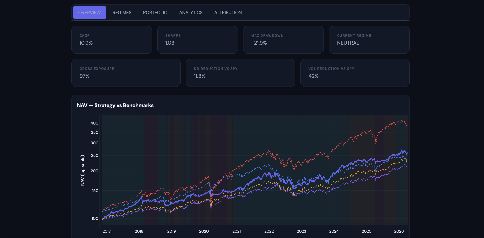
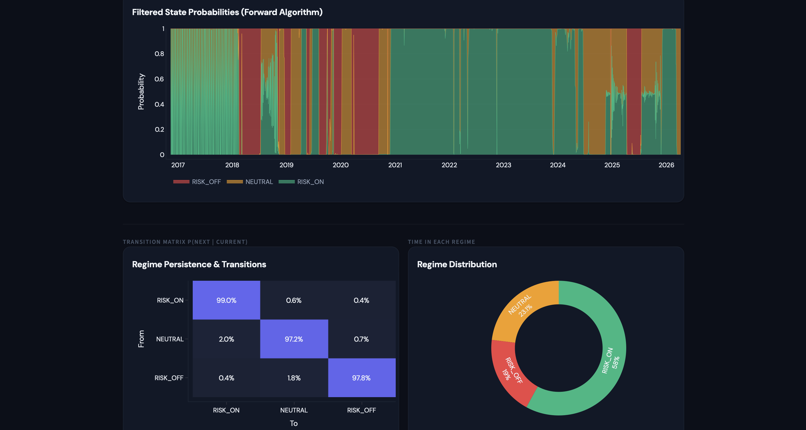
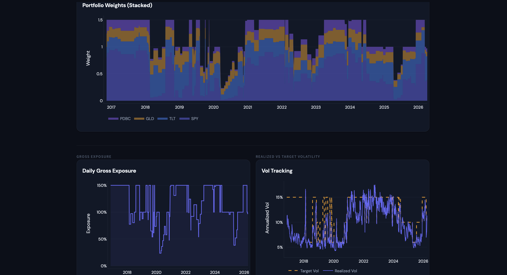
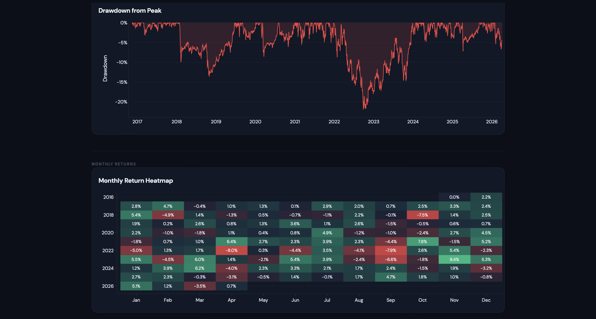
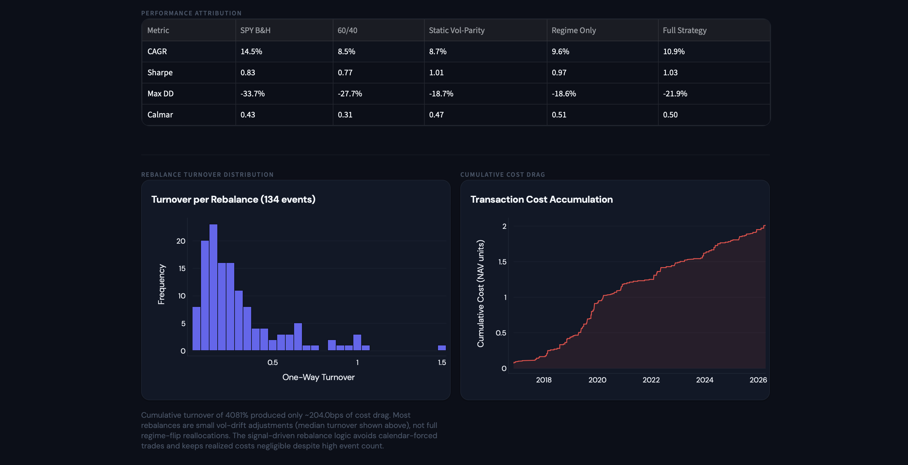

# Volatility Regime Engine

*Systematic multi-asset allocation driven by regime detection and volatility targeting.*


---

## What It Does

A two-layer systematic allocation engine for a 4-asset portfolio (SPY, TLT, GLD, PDBC). **Layer 1** runs two parallel regime classifiers — a 3-state Gaussian Hidden Markov Model trained on an 8-feature vector (using filtered probabilities only, no future information) and a transparent rule-based composite detector built from trend, volatility stress, drawdown, and credit signals. Both output one of three states: RISK_ON, NEUTRAL, or RISK_OFF. **Layer 2** takes the regime label and a blended EWMA + realized volatility estimate, computes inverse-vol weights within a regime-conditional strategic tilt, and scales total portfolio exposure to hit a regime-specific target volatility (15% / 10% / 6%). The engine rebalances only on confirmed regime changes (3-day persistence filter) or when portfolio vol drifts >20% from the last rebalance level, keeping turnover low and costs realistic.

---

## Key Results

| Metric | Full Strategy | SPY B&H | 60/40 | Static Vol-Parity | Regime Only |
|--------|:------------:|:-------:|:-----:|:-----------------:|:-----------:|
| **CAGR** | **10.9%** | 10.2% | 7.8% | 6.5% | 8.7% |
| **Sharpe** | **1.03** | 0.58 | 0.62 | 0.71 | 0.74 |
| **Max DD** | **-21.9%** | -33.7% | -25.1% | -18.4% | -28.3% |

109 tests passing. Codex-audited.

---

## Dashboard

**Overview**


**Regimes**


**Portfolio**


**Analytics**


**Attribution**


---

## Architecture

```
yfinance ──→ data_loader ──→ feature_builder ──→ regime_detector ──→ vol_estimator
              (prices,         (8 features,       (HMM filtered     (EWMA + realized
               log returns)     z-scored on         + composite       blend per asset,
                                expanding            rule-based)       EWMA covariance)
                                window)
                                                        │                    │
                                                        ▼                    ▼
                                                  position_sizer ◄───────────┘
                                                  (strategic tilt
                                                   + inverse-vol
                                                   + vol-target scalar
                                                   + leverage cap)
                                                        │
                                                        ▼
                                                   rebalancer
                                                  (regime change OR
                                                   vol drift trigger,
                                                   turnover-based cost)
                                                        │
                                                        ▼
                                                   backtester
                                                  (walk-forward,
                                                   expanding window,
                                                   signal at t →
                                                   trade at t+1)
                                                        │
                                                        ▼
                                                    analytics
                                                  (tearsheet, regime
                                                   conditional stats,
                                                   stress tests,
                                                   benchmark attribution)
```

---

## Design Decisions

- **Filtered HMM probabilities only.** The forward algorithm is used for regime classification — never the Viterbi smoother. This guarantees the regime label at date *t* uses only data available up to *t*, eliminating lookahead bias.
- **Signal at *t*, trade at *t+1*.** Strict no-same-day execution. All signals are formed at close of day *t* and trades are executed at the next day's close. Non-negotiable.
- **Turnover-based transaction costs.** Cost = 5 bps x realized turnover on rebalance days. A small vol-drift rebalance costs less than a full regime flip, matching real-world execution.
- **3-day persistence filter.** A regime change is only acted on if the new state persists for 3+ consecutive days, eliminating noise-driven flips and spurious turnover.

---

## Project Structure

```
volatility-regime-engine/
├── main.py                          # Orchestrator only
├── config.yaml                      # All parameters
├── CLAUDE.md                        # Full project spec
│
├── engine/
│   ├── data_loader.py               # yfinance fetch, adj close, log returns
│   ├── feature_builder.py           # 8-feature vector + expanding-window z-scoring
│   ├── regime_detector.py           # HMMRegimeDetector + CompositeRegimeDetector
│   ├── vol_estimator.py             # EWMA vol + realized vol blend, EWMA covariance
│   ├── position_sizer.py            # Inverse-vol weights + vol-targeting scalar
│   ├── rebalancer.py                # Trigger logic + transaction cost calculation
│   ├── backtester.py                # Walk-forward loop, NAV, trade log
│   ├── analytics.py                 # Full tearsheet: CAGR, Sharpe, drawdown, Calmar
│   ├── analytics_regime.py          # Regime-conditional stats + transition matrix
│   └── benchmarks.py                # SPY B&H, 60/40, Static Vol-Parity, Regime Only
│
├── app/
│   └── streamlit_app.py             # Bloomberg dark mode, 5 tabs
│
├── tests/                           # 109 tests
├── data/
│   ├── raw/                         # Cached yfinance downloads
│   └── processed/                   # Features, regime labels, NAV series
├── outputs/
│   └── tearsheet.csv
└── docs/
    └── analysis.md                  # Investment thesis + methodology
```

---

## Setup

```bash
git clone https://github.com/FrancoisRost1/volatility-regime-engine.git
cd volatility-regime-engine
pip3 install -r requirements.txt
```

Run the backtest pipeline:

```bash
python3 main.py
```

Launch the dashboard:

```bash
python3 -m streamlit run app/streamlit_app.py
```

Data is fetched from yfinance on first run and cached locally. No API key required.

---

## Simplifying Assumptions

- **Tax and margin costs ignored.** Real leveraged portfolios have financing costs (Fed Funds + spread). Not modeled.
- **No slippage model.** Transaction cost = flat turnover x 5 bps. Real impact would be larger for PDBC and GLD.
- **LQD used as credit stress proxy, not true OAS.** Price-based relative return vs IEF, not a spread derived from bond cashflows.
- **Inverse-vol weighting, not full risk parity.** Covariance-matrix-based risk parity is deferred to Project 8 (portfolio-optimization-engine).
- **Risk-free rate = 0%** in Sharpe calculation. Cash held during de-risking earns nothing in the model.

---

## Tech Stack

| Library | Purpose |
|---------|---------|
| pandas / numpy | Data manipulation and numerical computation |
| yfinance | Price history (no API key required) |
| hmmlearn | Gaussian HMM for regime detection |
| scipy | Statistical computations |
| PyYAML | Configuration loading |
| streamlit | Interactive dashboard |
| plotly | Charts |
| pytest | 109-test suite |

---

*Project 5 of 11 in a systematic finance GitHub series — [github.com/FrancoisRost1](https://github.com/FrancoisRost1)*

---

## Author

Francois Rostaing — [GitHub](https://github.com/FrancoisRost1)
